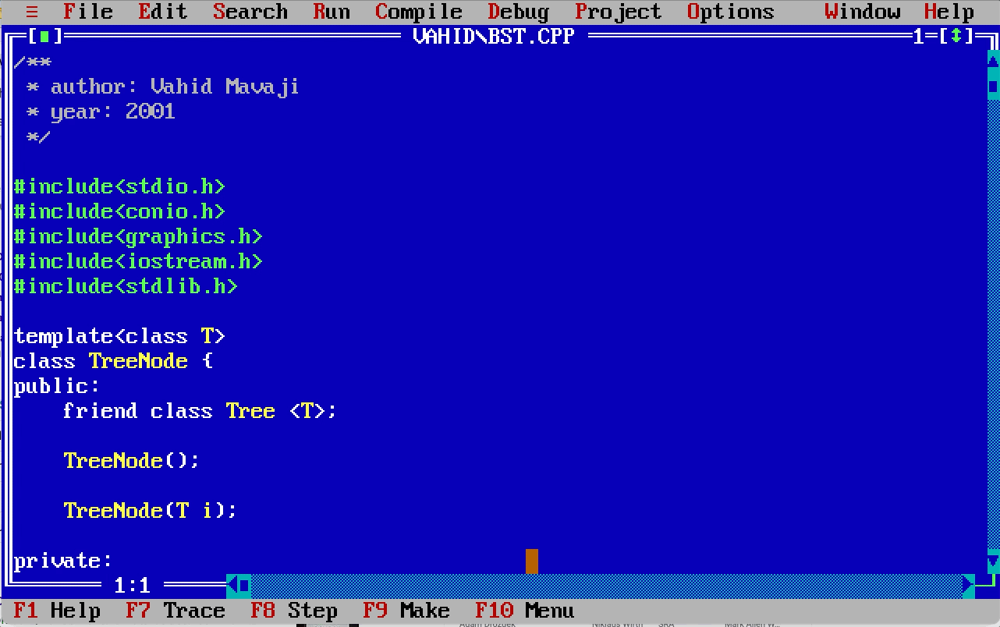

# bst
A binary search tree with graphical representation.

[BST in Wikipedia](https://en.wikipedia.org/wiki/Self-balancing_binary_search_tree)

#### Prerequisites
You may have MS-DOS installed on bare metal, in VirtualBox, or via DosBox. It doesn't work under Windows systems.

#### Sample Execution
```text
Input Data:10
Input Data:50
Input Data:60
Input Data:70
Input Data:-1
Inorder Sweep: 10 50 60 70 
Heigth Of Tree is :3
Press any key to see graph of Tree...
Press any key to continue...

Inorder sweep of inverted tree is :70 60 50 10 
Heigth of inverted Tree is : 3
Press any key to see graph of Tree...
```

